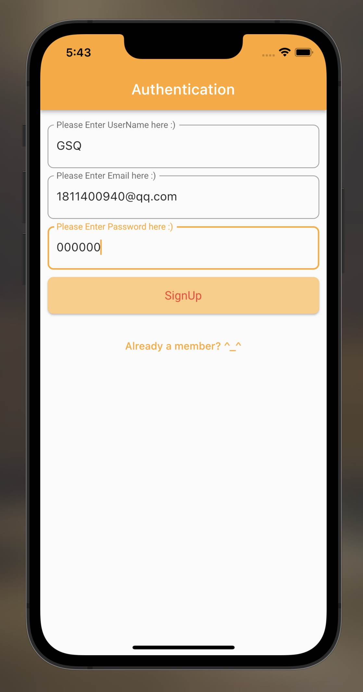

# Implement a ToDo APP

Reference: [Author. Madan](https://www.youtube.com/watch?v=qFrJ30VFCFc&list=PL9n0l8rSshSnT19B70XO9dYUucjD3aYWa&index=36), [Author. Dev Stack](https://www.youtube.com/watch?v=p1NPtRdvQBU&list=PLtIU0BH0pkKrQZUFWENF_VXINhfv9WiIA)

> Follow the tutorials to see how it works.

 

## 1. 在创建Flutter 新项目后连接上[Firebase](https://console.firebase.google.com/u/0/?hl=zh-cn&pli=1)

- Bundle Identifier in `./macos/Runner/Configs/AppInfo.xcconfig`
- More details in [Configure 1](https://www.kindacode.com/article/flutter-configure-firebase-for-ios-and-android/),  [Configure 2](https://www.jianshu.com/p/cff76974d983),  [Configure 3](https://softauthor.com/add-firebase-sdk-to-your-ios-app-using-cocoapods/#:~:text=Add%20Initialization%20Code%20Open%20up%20FirebaseiOSDemo%20folder%20from,lines%20of%20code.%20One%20is%20at%20the%20top%3A), [Official Document](https://firebase.google.com/docs/ios/setup?authuser=0&hl=zh-cn)

  暂时不考虑Facebook，Google登陆

 

> In the Console,  `r`  to hot reload

 

## 2. 在 `./lib `下main文件中构建主体框架

- 在 `./lib/displays ` 设计主页

  - Container ➡️ Scaffold
  - Problem: [Prefer const with constant], [Solutions](https://stackoverflow.com/questions/68554055/flutter-const-with-const-constructors)
  - Problem: [Color Effect not work], [Solution](https://github.com/flutter/flutter/issues/89839)

    > `stf` to use Stateful Widget
    >

  main可以作为主要框架，导入lib下其他dart文件做组件，比如 home page

   
- 在 `./lib/auth ` 设计验证界面

  - Form 除设计外，需要设置 validator, 判断用户状态 onSave保存输入
  - 判断是否已登录或未注册只需要通过三元表达式即可， 状态的改变由 onPress setState 进行
  - 除此以外，用函数和 FirebaseAuth 处理 Auth 的 User 整体登录或注册进程
  - Login and [ Log OUT in HomePage! ]

   
- 对于 HomePage, UI 设计 和 增删改查 ( 通过 Navigator + Route 页间跳转 )

  - 在 HomePage 附属页 add_tasks 进行数据增添，

    - 有意思的是可以直接通过 MaterialState 控制组件的变化
    - 和 Auth 步骤类似，在界面设计结束后，Adding Controller 以及函数处理 Text Field 的数据
    - 这时要处理的 Auth 涉及到不同 users, also use dependencies `intl` and `fluttertoast` for msg
  - HomePage 还需要负责 log out，查询信息返回显示（这里遇到了问题，可增添返回得数据在Cloud Firebase 控制面板不显示？... debug不出来好难受，有空再看）

   
- 最后，整理完其他样式问题

- Assets, 可以加设图片 Image.asset('assets/')

- 没有制作 Description 页面，只是整体上简单串了一遍

## 3. Firebase Authorization

- firebase 对接 auth（Authentication [Users] 和 [Sign-in method]）

  封装出 auth 组件模块
- authpage 滚动条内置Bar 和 body（Form）
- SizedBox 和 Container [比较](https://stackoverflow.com/questions/55716322/flutter-sizedbox-vs-container-why-use-one-instead-of-the-other)， 各种尺寸限制类容器： [全网最详细的一篇Flutter 尺寸限制类容器总结](https://zhuanlan.zhihu.com/p/111167367)
- 设计 form => 登录表单
- 在 Form 封装登陆注册操作的时候，console.firebase.google.com 上创建云数据库对接 Firebase 实例，如" 规则
- `./pubspec.yaml` 内更新 dependencies [ [配置](https://www.cnblogs.com/mengqd/p/13928830.html) ] Check Currnet Version in the right way [How to set dependencies in the right way in pubspec.yaml in Flutter - Stack Overflow](https://stackoverflow.com/questions/65358889/how-to-set-dependencies-in-the-right-way-in-pubspec-yaml-in-flutter) and [How to Add a dependency in pubspec.yaml | by Vivek Yadav | Medium](https://viveky259259.medium.com/how-to-add-a-dependency-in-pubspec-yaml-c8bba8485454)
- Firebase Init 数据可以在 Auth 显示

  

Config, CHECK THIS [Configuring Firebase for Android and iOS App - Flutter Blog App (iOS and Android Blog App) - YouTube](https://www.youtube.com/watch?v=WIG4TxLYQk0&t=445s)

# Final Demo

