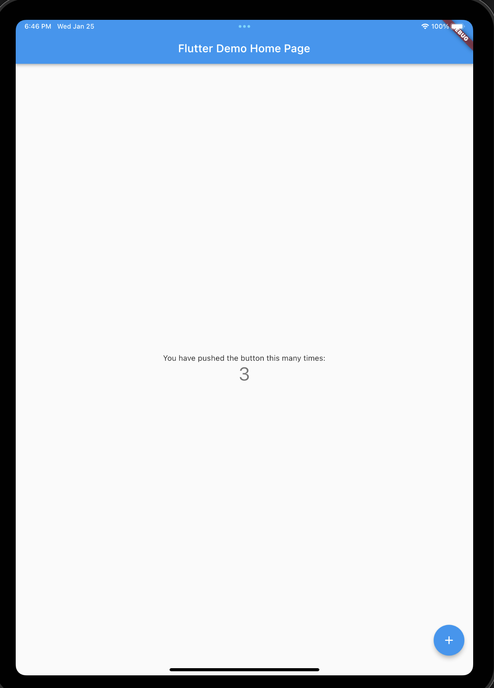

```bash
(base) bogon:flutter_application_getstarted gsq$ flutter run
Launching lib/main.dart on iPad Pro (11-inch) (4th generation) in debug mode...
Running Xcode build...                                                  
 └─Compiling, linking and signing...                         4.6s
Xcode build done.                                           14.6s
Syncing files to device iPad Pro (11-inch) (4th generation)...        195ms

Flutter run key commands.
r Hot reload. 🔥🔥🔥
R Hot restart.
h List all available interactive commands.
d Detach (terminate "flutter run" but leave application running).
c Clear the screen
q Quit (terminate the application on the device).

💪 Running with sound null safety 💪

An Observatory debugger and profiler on iPad Pro (11-inch) (4th generation) is available at: http://127.0.0.1:49362/1HUYO2opwlk=/
The Flutter DevTools debugger and profiler on iPad Pro (11-inch) (4th generation) is available at: http://127.0.0.1:9101?uri=http://127.0.0.1:49362/1HUYO2opwlk=/
```


Demo running: 




`sudo gem install cocoapods -v 1.8.4` to deal with warning.
